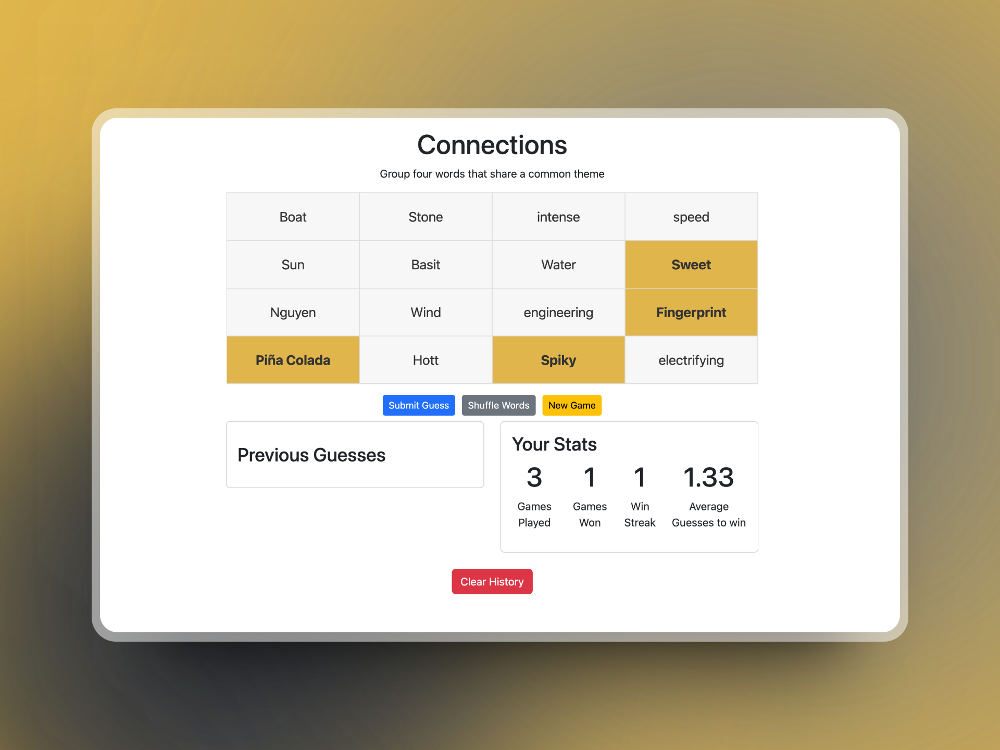

# Connections Game

  

This is a simple implementation of the Connections Game. The game involves guessing connections between words. It's implemented only using client-side JavaScript. This game was developed for CS 4640 - Web Programming at the University of Virginia.

## Features

- Select words from a table
- Submit guesses
- Shuffle words
- Start a new game
- Clear game history
- Game statistics

## How to Play

1. Choose 4 words from the table.
2. Click on 'Submit Guess' to submit your guess.
3. If you want to shuffle the words, click on 'Shuffle Words'.
4. To start a new game, click on 'New Game'.
5. Your game history can be cleared by clicking on 'Clear History'.

## Game Statistics

The game keeps track of the following statistics:

- Games Played
- Games Won
- Current Win Streak
- Average Guesses per Game

## Technologies Used

- HTML
- CSS
- JavaScript
- Bootstrap

## Local Storage

The game uses local storage to save and load game data.

## Future Improvements

-
